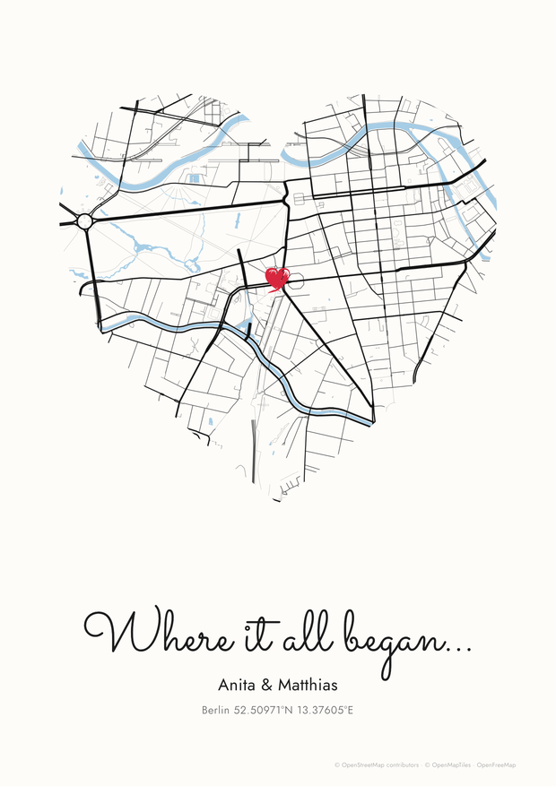

# Where it all began

Create a minimalist **“where it all began…”** map poster: pick a place, frame it in a heart, add
your names and download a print-ready file.

**Try it:** https://mkoterski.github.io/where-did-it-start/



## Features

- **Place:** search, click the map, drag the marker (live preview), nudge it with arrows, use
  _Precise placement_, or type coordinates.
- **Shape:** heart, circle, rounded square, diamond, hexagon or star; the map outside can be
  hidden, faded or shown.
- **Marker:** heart, circle, pin, star or diamond in a brush, brush-outline, felt-tip, pencil or
  clean look, with adjustable size, colour and opacity.
- **Text:** title, names, place and coordinates, with a choice of fonts.
- **Look:** colour presets, light-blue or custom water, line weight, paper size and orientation.
- **Download:** PNG, PDF or SVG at 150 or 300 dpi. Designs are saved in the browser and can be
  shared as a link.

## Development

Requires Node.js 20.19+.

```bash
npm install
npm run dev     # http://localhost:5173
npm run check   # typecheck, lint, format check, tests and build (same as CI)
```

Pushes to `main` are checked and deployed to GitHub Pages by `.github/workflows/deploy.yml`
(one-time setup: **Settings → Pages → Source: GitHub Actions**).

Code lives in `src/`: `domain/` (pure logic: layout, map style, shapes, brush), `components/`
(editor and preview), `export/` (high-resolution rendering) and `geocoding/`.

## Map data and providers

| Purpose   | Provider                                                     | API key |
| --------- | ------------------------------------------------------------ | ------- |
| Map tiles | [OpenFreeMap](https://openfreemap.org) (OpenMapTiles schema) | No      |
| Rendering | [MapLibre GL JS](https://maplibre.org)                       | –       |
| Search    | [Nominatim](https://nominatim.org)                           | No      |

Map data is © [OpenStreetMap contributors](https://www.openstreetmap.org/copyright) (ODbL).
Posters print a small credit line by default; keep it on for posters you share or sell.
Searches follow the
[Nominatim usage policy](https://operations.osmfoundation.org/policies/nominatim/) (on submit
only, max. 1 request per second). For heavy use, point the app to your own servers with the
optional variables in `.env.example`. They are public in the build, so never put secrets there.

## Notes

- Text, shapes and the marker are vectors in the SVG. The map itself is a high-resolution
  image in all formats.
- 300 dpi downloads are capped at about 36 megapixels, so 50 × 70 cm comes out at ~212 dpi.
- To add a shape, add it to `src/domain/shapes.ts` (and its id to `src/domain/types.ts`).
